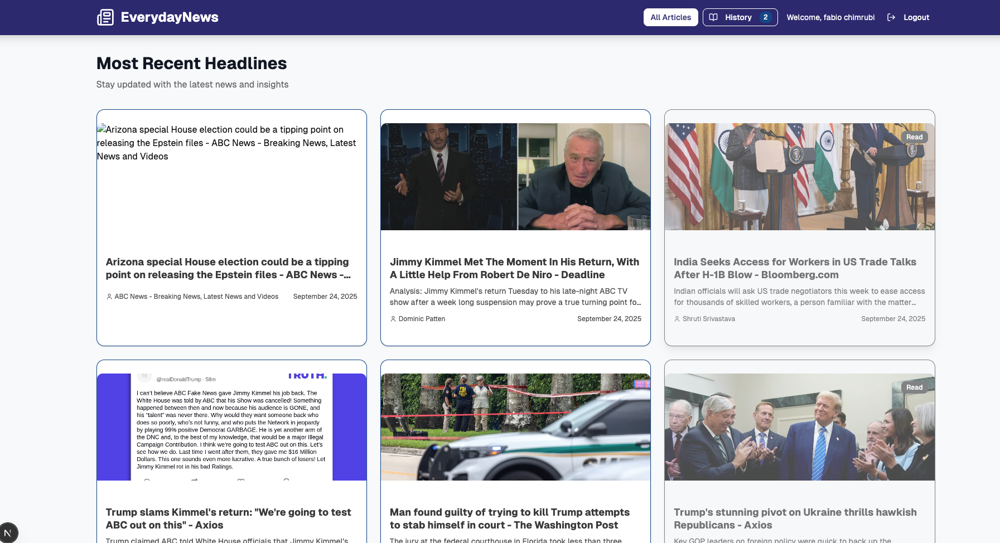
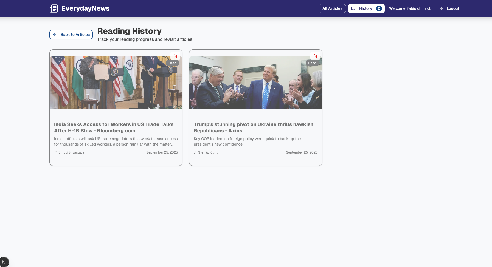

# NewsReader

A full-stack news reading application built with Python (FastAPI) for the backend and React/Next.js with ShadCN UI components for the frontend.  
This app fetches news articles from a backend database and allows users to track their reading history.

---

## Features
- Browse latest news articles.
- Mark articles as read and track reading history.
- Remove articles from reading history 
- Reading history persisted in SQLite database.
- Responsive UI with clean design.
- Backend and frontend fully connected via API.
- CORS enabled for development.
- Clicking an article opens the main website link.

---

## Tech Stack
- **Frontend:** React, Next.js, TypeScript, Tailwind CSS, ShadCN UI
- **Backend:** Python, FastAPI, Uvicorn
- **Database:** SQLite
- **Environment Variables:** `.env` for configuration
- **State Management:** React hooks

---

## Installation & Setup

### Backend
```bash
cd backend
python3 -m venv venv
source venv/bin/activate  # Windows: venv\Scripts\activate
pip install -r requirements.txt
uvicorn main:app --reload
```

## Frontend
1. Navigate to the frontend folder:
    ```bash
    `cd frontend`
    `npm install`
2. Run the frontend:
    ```bash
    `npm run dev`
3. Open your browser at http://localhost:3000

## API Endpoints
GET /articles           → Fetch all news articles
GET /history            → Get user reading history
POST /history           → Add article to reading history
DELETE /history/{id}    → Remove article from history


## Response JSON Example (History):

```bash
[
  {
    "id": 1,
    "news_id": 39,
    "title": "Man found guilty of trying to kill Trump attempts to stab himself in court - The Washington Post",
    "summary": "Brief summary of the article here...",
    "author": "John Doe",
    "imageUrl": "https://example.com/image.jpg",
    "read_at": "2025-09-25T05:12:58.437986"
  }
]

```


### ***Screenshots***



## Future Improvements
- Integrate external news APIs for live articles.
- Integrate external news APIs for live articles.
- Deploy backend (Railway/Render) and frontend (Vercel).


### AUTHOR

Kimberly Galos