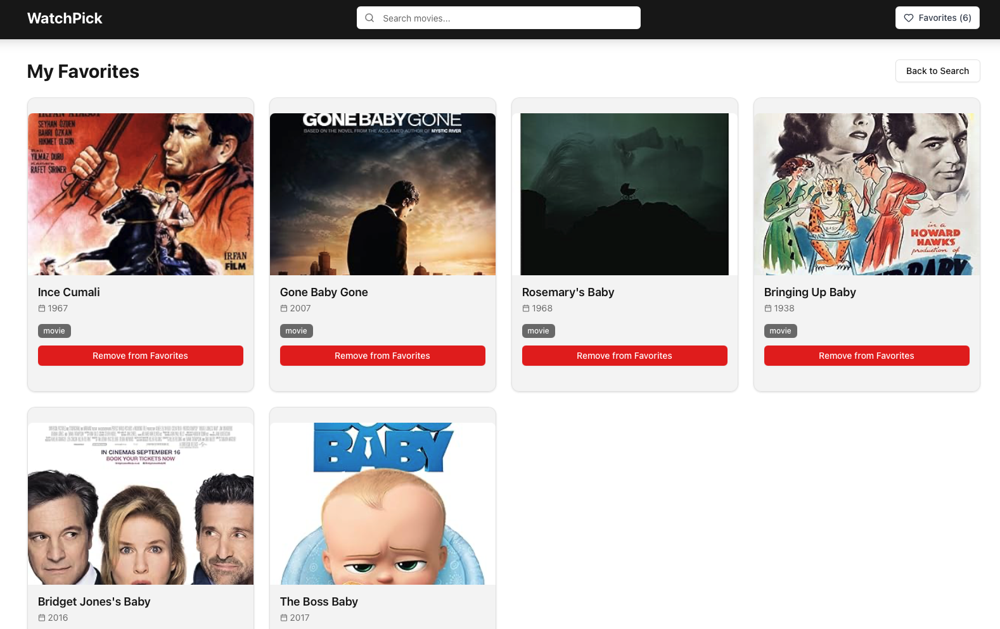

# WatchPick

A full-stack movie favorites application built with **Python (FastAPI)** for the backend and **React/Next.js** with **ShadCN UI components** for the frontend.  
This app fetches movie data from the **OMDb API** and allows users to save their favorite movies in a **SQLite database**.

---

## Features

- Search for any movie using the OMDb API.
- Add movies to favorites.
- Remove movies from favorites.
- Favorites are persisted in a SQLite database (not just local state).
- Responsive UI with clean design.
- Backend and frontend fully connected via API.
- CORS enabled for development.

---

## Tech Stack

- **Frontend:** React, Next.js, TypeScript, Tailwind CSS, ShadCN UI  
- **Backend:** Python, FastAPI, Uvicorn  
- **Database:** SQLite  
- **API:** OMDb API  
- **Environment Variables:** `.env` for API key  

---

## Installation & Setup

### Backend

1. Navigate to the backend folder:
   ```bash
   `cd backend`
2. Create and activate a virtual environment:
    ```bash
    `python3 -m venv venv`
    `source venv/bin/activate `  # Windows: venv\Scripts\activate
3. Install dependencies
    ```bash
    `pip install -r requirements.txt`
4. Create a .env file with your OMDb API key:
    ```bash
    `OMDB_API_KEY=your_api_key_here`
5. Run the backend:
    ```bash
    `uvicorn main:app --reload`

## Frontend
1. Navigate to the frontend folder:
    ```bash
    `cd frontend`
    `npm install`
2. Run the frontend:
    ```bash
    `npm run dev`
3. Open your browser at http://localhost:3000

## API Endpoints
- GET /movies?title={movie_title} → Search movies from OMDb
- GET /favorites → Get all favorite movies
- POST /favorites → Add a movie to favorites
- DELETE /favorites/{imdbID} → Remove a movie from favorites

## Response JSON Example (Search):

```bash
[
  {
    "imdbID": "tt1375666",
    "Title": "Inception",
    "Year": "2010",
    "Type": "movie",
    "Poster": "https://m.media-amazon.com/images/M/MV5BMjAxMzY3NjY5NV5BMl5BanBnXkFtZTcwODI5OTM0Mw@@._V1_SX300.jpg"
  }
]
```


### ***Screenshots***


## Future Improvements
- Add user authentication (favorites per user).
- Display default “Discover” movies on homepage.
- Add toast notifications for add/remove actions.
- Deploy backend (Railway/Render) and frontend (Vercel).


### AUTHOR

Kimberly Galos