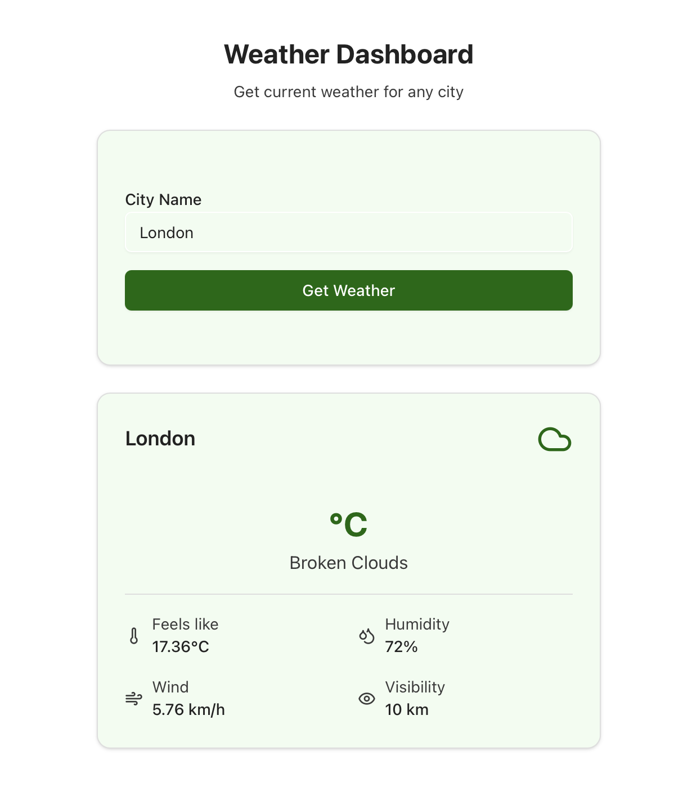

# Weather Dashboard

A full-stack weather application built with **Python (FastAPI)** for the backend and **React/Next.js** with **V0 UI components** for the frontend.  
This app fetches real-time weather data from the **OpenWeatherMap API** and displays it dynamically in a dashboard.

---

## Features

- Search for any city to see current weather.
- Displays:
  - Temperature
  - Weather description
  - Feels like temperature
  - Humidity
  - Wind speed
  - Visibility
- Responsive UI with dynamic weather icons.
- Backend and frontend fully connected via API.
- CORS enabled for development.

---

## Tech Stack

- **Frontend:** React, Next.js, TypeScript, Tailwind CSS, V0 UI components  
- **Backend:** Python, FastAPI, Uvicorn  
- **API:** OpenWeatherMap  
- **Environment Variables:** `.env` for API key and default units

---

## Installation & Setup

### Backend

1. Navigate to the backend folder:
   ```bash
   `cd backend`
2. Create and activate a virtual environment:
    `python3 -m venv venv`
    `source venv/bin/activate  `

3. Install dependencies:
    `pip install -r requirements.txt`
4. Create a .env file with your OpenWeatherMap API key:
    `OPENWEATHER_API_KEY=your_api_key_here`
    `DEFAULT_UNIT=metric`
5. Run the backend:
    `uvicorn main:app --reload`


### Frontend
1. Navigate to the frontend folder (root or app):
    `npm install`
2. Run the frontend:
    `npm run dev`
3. Open your browser at http://localhost:3000 to see the dashboard.

### API Endpoint
`GET /weather?city={city_name}`
*** Response JSON Example: ***
{
  "city": "London",
  "temperature": 20,
  "feels_like": 19,
  "humidity": 60,
  "wind": 5,
  "visibility": 10000,
  "weather": "clear sky"
}

***Screenshots***



## Future Improvements
- Add forecast for upcoming days.
- Include weather icons based on API data.
- Deploy backend and frontend for live use.

#AUTHOR

Kimberly Galos